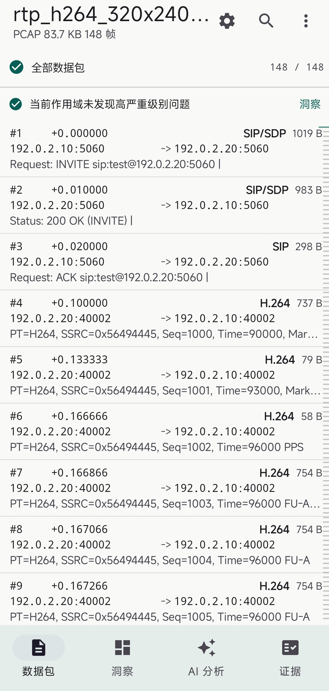
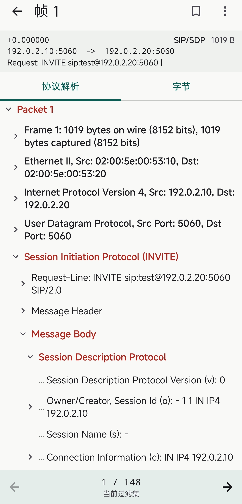
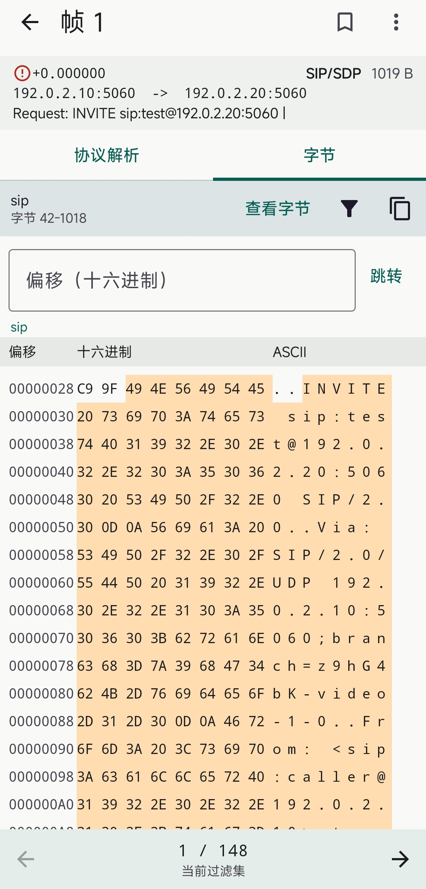
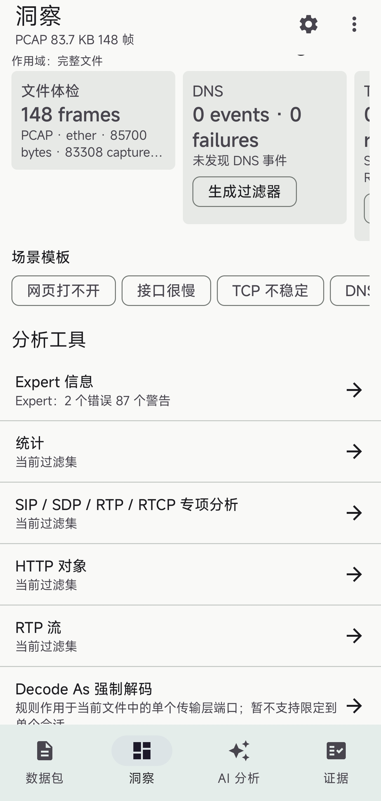
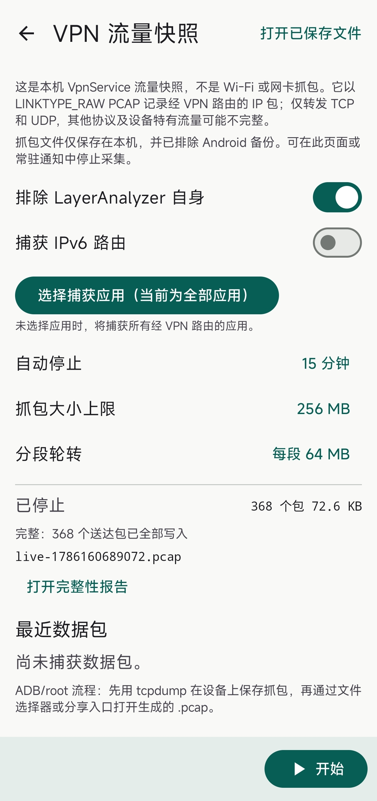
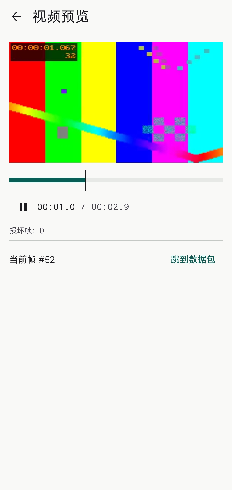
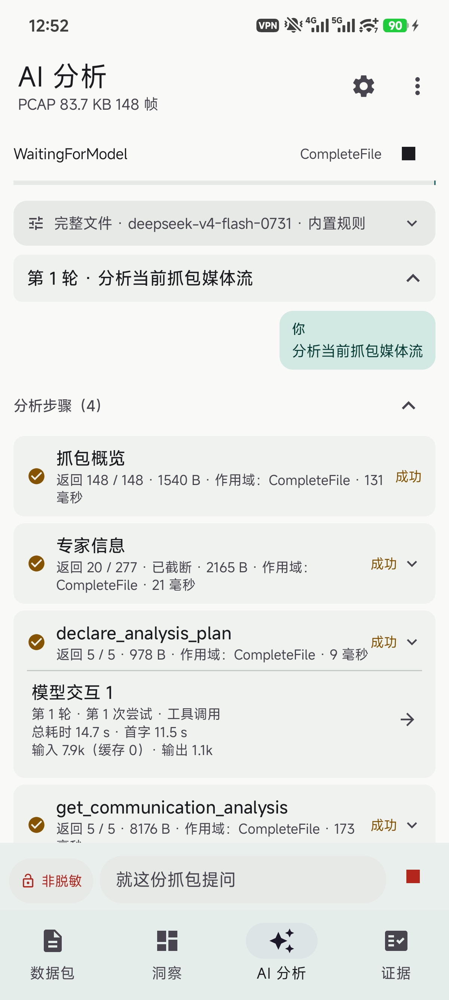
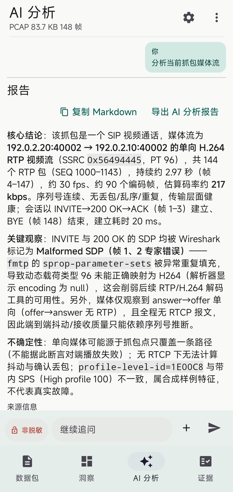
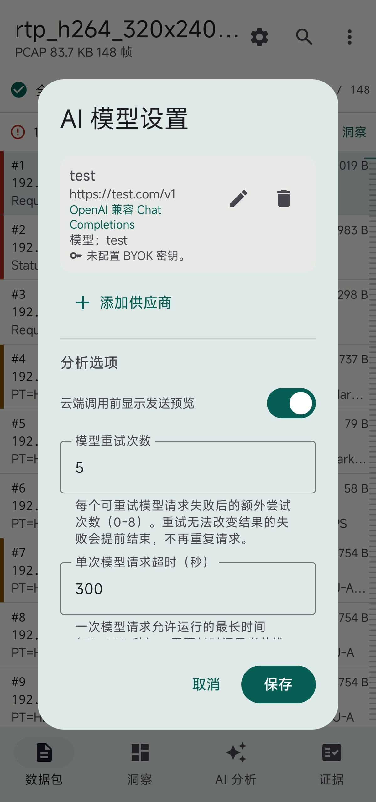

# LayerAnalyzer

The pinned Wireshark 4.0.10 libraries have no security backports, and the upstream 4.0 series is out of support. See the [security maintenance assessment](docs/wireshark-security-maintenance.md) for known issues, unresolved checks, and APK validation limits.

[简体中文](README.md)

LayerAnalyzer is an Android packet capture and analysis application built with Wireshark 4.0.10, Kotlin, Jetpack Compose, and C++ JNI.

Original author and maintainer: [cheig](https://github.com/cheig). Upstream project: [cheig/LayerAnalyzer](https://github.com/cheig/LayerAnalyzer). Original code Copyright (c) 2026 cheig; see [AUTHORS.md](AUTHORS.md) for authorship and contributions and [COPYRIGHT](COPYRIGHT) for the copyright notice.

## Features

- Open PCAP/PCAPNG files, browse packets and protocol trees, inspect bytes, and apply Wireshark display filters.
- Inspect protocol statistics, conversations, TCP/UDP streams, and exported HTTP objects.
- Capture device traffic through Android's VPN interface with the user's VPN permission.
- Analyze SIP/RTP/RTCP streams and calls; play or export supported audio and video.
- Optionally use an AI service with your own API key. Privacy settings control the data sent to the provider, and analysis reports reference packet evidence.

Requires Android 8.0 (API 26) or later. Release packages target ARM64; an x86_64 emulator variant is available for development.

## Screenshots

The screenshots show the Chinese interface. Click any screenshot to view the full-size image.

| Packet list | Protocol details | Byte view |
|:---:|:---:|:---:|
| <a href="assets/images/Screenshot_2026-10-05-12-50-42-652_com.layeranalyzer.android-edit.jpg"></a> | <a href="assets/images/Screenshot_2026-10-05-12-51-00-179_com.layeranalyzer.android-edit.jpg"></a> | <a href="assets/images/Screenshot_2026-10-05-13-04-58-044_com.layeranalyzer.android-edit.jpg"></a> |

| Insights and analysis tools | VPN capture | Video preview |
|:---:|:---:|:---:|
| <a href="assets/images/Screenshot_2026-10-05-13-03-30-323_com.layeranalyzer.android-edit.jpg"></a> | <a href="assets/images/Screenshot_2026-10-05-13-04-05-274_com.layeranalyzer.android-edit.jpg"></a> | <a href="assets/images/Screenshot_2026-10-05-12-51-26-626_com.layeranalyzer.android-edit.jpg"></a> |

| AI analysis progress | AI analysis report | AI model settings |
|:---:|:---:|:---:|
| <a href="assets/images/Screenshot_2026-10-05-12-52-41-074_com.layeranalyzer.android.jpg"></a> | <a href="assets/images/Screenshot_2026-10-05-12-58-21-989_com.layeranalyzer.android-edit.jpg"></a> | <a href="assets/images/Screenshot_2026-10-05-13-00-32-735_com.layeranalyzer.android-edit.jpg"></a> |

## Install

Download the ARM64 APK and SHA256SUMS from [GitHub Releases](https://github.com/cheig/LayerAnalyzer/releases). Each release documents its validation scope. This repository provides the complete application source. Packaging continues with the pinned Wireshark 4.0.10 / r1 native libraries; upgrades and security backports are follow-up maintenance work. Development build instructions follow. See the [maintenance assessment](docs/wireshark-security-maintenance.md) for known issues.

Open Preferences → About LayerAnalyzer in the app to view the author and project address, copy the address, or open the project repository.

## Build

Install JDK 17, Android SDK 34, NDK `27.0.12077973`, CMake `3.22.1`, and Python 3.10+. Android Studio's SDK Manager can install the Android toolchain. Set `ANDROID_HOME` or configure `sdk.dir` in an untracked `local.properties` file.

```sh
git clone https://github.com/cheig/LayerAnalyzer.git
cd LayerAnalyzer
python tools/fetch_native_deps.py
./gradlew assembleDebug
```

On Windows, use `.\gradlew.bat`. The download script checks the bundle and each library against the SHA-256 values in [native-deps.json](native_build/native-deps.json); no GitHub token is required. Tunnel sources are included directly, so no submodule setup is needed.

| Target | Gradle task | Output |
|---|---|---|
| ARM64 debug | `assembleDebug` | `app/build/outputs/apk/debug/app-debug.apk` |
| x86_64 emulator | `assembleEmulator` | `app/build/outputs/apk/emulator/app-emulator.apk` |
| Install ARM64 debug | `installDebug` | Connected ARM64 device |
| Install emulator build | `installEmulator` | Connected x86_64 emulator |

Debug builds use the developer's default Android debug key. Release signing is configured through environment variables, as described in [CONTRIBUTING.md](CONTRIBUTING.md). Packages with different signing certificates cannot directly update one another.

The pinned dependency release provides the binary ZIP, complete native source, build patch, license materials and SHA256SUMS together. No GitHub Token is required. If you already have the ZIP, use `python tools/fetch_native_deps.py --archive <path-to-zip>`; the same hashes are enforced.

## Native dependencies and source

The native bundle is hosted in [LayerAnalyzer_libs](https://github.com/cheig/LayerAnalyzer_libs/releases/tag/wireshark-4.0.10-r1). It contains both supported ABIs and is approximately 154 MiB compressed or 577 MiB unpacked.

[native-sources.json](native_build/native-sources.json) pins the corresponding source archive, its checksum, upstream revisions, and local modifications. The archive includes complete source inputs for Wireshark, GLib, libgcrypt, libgpg-error, c-ares, libffi, PCRE2, zlib, and libiconv, together with Android build scripts and patches. The 29 Wireshark reference files under `app/src/main/cpp/third_party/wireshark-reference/` are additional porting references, not the full corresponding source.

Rebuilding dependencies requires Linux or WSL2 and the Linux NDK. The pinned r2 source archive needs the documented build-script compatibility patch before rebuilding; see [CONTRIBUTING.md](CONTRIBUTING.md#原生依赖重建). Both ABIs have been rebuilt in isolated directories. [Provenance records](docs/native-provenance.md) distinguish the pinned r1 binaries, rebuilt candidates, configuration differences, and validation limits. Normal application builds continue to use the pinned binaries; byte-identical reproduction is not promised.

## Tests and contributions

```sh
./gradlew testDebugUnitTest lintDebug
node tools/golden_capture/generate_golden_captures.mjs --check
node tools/agent_metrics/summarize.mjs --check
cmake -S native_build/verification/rtp/host_tests -B build/rtp-host -DCMAKE_BUILD_TYPE=Debug
cmake --build build/rtp-host --parallel
./build/rtp-host/rtp_host_tests
```

Tool checks require Node.js 18+. Native algorithm tests require a host C++ compiler and CMake. See [CONTRIBUTING.md](CONTRIBUTING.md) for locally supplied external test fixtures and contribution guidance, and [SECURITY.md](SECURITY.md) for private vulnerability reporting.

## License and responsible use

LayerAnalyzer is distributed under **GNU GPL version 3 (GPL-3.0)**; see [LICENSE](LICENSE). The bcg729 G.729 decoder is enabled by default. `-PlayanalyzerEnableG729=false` disables that decoder without changing the application license. iLBC is disabled by default and can be enabled with `-PlayanalyzerEnableIlbc=true`.

Dependencies retain their individual licenses; see [THIRD_PARTY_NOTICES.md](THIRD_PARTY_NOTICES.md). Distributing binaries or modified versions entails the applicable source and attribution requirements.

Analyze only networks and data you are authorized to access. Captures, diagnostics, and exports can contain sensitive information. Review privacy settings before enabling a remote AI service and verify its conclusions against the original evidence. The software comes without warranty, as described in the license.
